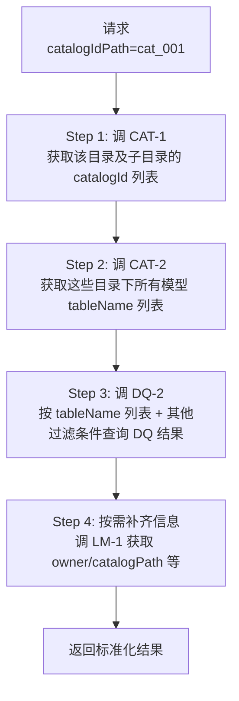
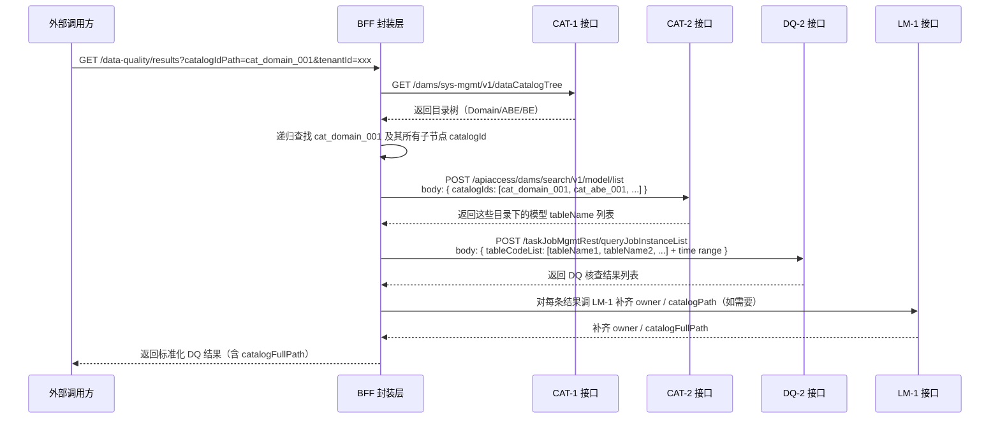

# 旧 API 进行多维度查询 OpenAPI 接口设计方案

> 本文档用于指导工程师如何将企业内部已有的零散老接口，封装为符合 OpenAPI 3.1 规范的统一查询接口。面向工程化落地实现供参考。

**日期：** 2026-05-23（v2.1）
**项目：** 元数据管理查询接口（Metadata Query API）
**仓库：** https://github.com/xiaodingdangdaddy/openApiLab

---

## 一、项目背景

### 1.1 问题描述

企业内部存在一批零散的已有接口，各自独立、风格不统一，外部系统（DataHub 等）对接成本高。

| 问题 | 说明 |
|------|------|
| 路径不统一 | 各老接口路径各异，无统一前缀 |
| 参数格式各异 | 有的用 query，有的用 body，格式不标准 |
| 响应结构不统一 | 各接口返回字段名、层级不一致 |
| 串联成本高 | 业务场景需要跨多个接口调用，用户自行拼接 |

### 1.2 解决思路

**不是替换老接口**，而是在老接口前面加一层 BFF（Backend for Frontend）封装层，统一做参数转换、响应裁剪、接口串联，对外暴露标准化的 OpenAPI 接口。

```
外部调用方（DataHub / Dashboard）
        ↓ 调用新 OpenAPI（统一出口）
┌──────────────────────────────────────┐
│       新 OpenAPI BFF 层               │
│   - 路径统一（/data-quality/...）     │
│   - 参数标准化                        │
│   - 响应结构统一                      │
│   - 必要时串联多个老接口              │
└──────────────┬───────────────────────┘
               │
       ┌───────┴────────┐
       │   老接口层      │
       │（原有接口不变）  │
       └────────────────┘
```

---

## 二、老 API 接口清单

用户提供了 6 个已有接口的技术详情：

| 序号 | 接口名称 | 老路径 | 用途 |
|------|---------|--------|------|
| DQ-1 | DQ核查结果详情 | `POST /taskJobMgmtRest/queryJobInstanceDetail` | 根据 jobInsId 查询单条核查结果详情 |
| DQ-2 | DQ核查结果列表 | `POST /taskJobMgmtRest/queryJobInstanceList` | 分页查询 DQ 核查结果列表，支持时间过滤 |
| LM-1 | 逻辑模型详情 | `GET /dams/asset-mgmt/v1/logicalDataModel/datacompass/queryLogicalInfoByName` | 通过模型名称查询模型详情（含物理模型映射、catalogId、owner） |
| LM-2 | 逻辑模型血缘 | `GET /dams/asset-mgmt/v1/logicalDataModel/datacompass/queryLogicalModelsLineage` | 查询逻辑模型前向/后向血缘链路 |
| CAT-1 | TMF SID 目录树 | `GET /dams/sys-mgmt/v1/dataCatalogTree` | 查询 Domain/ABE/BE 各级目录树 |
| CAT-2 | 目录下模型搜索 | `POST /apiaccess/dams/search/v1/model/list` | 在指定目录下搜索逻辑模型 |

---

## 三、封装模式分类

老接口有三种封装模式，分别对应不同的业务场景：

### 模式 A：一一映射（直接代理）

**适用场景：** 新 OpenAPI 与老接口能力基本一致，只需做参数名和响应结构的标准化。

```
新 OpenAPI 参数 ──► 直传老接口参数
老接口响应     ──► 裁剪后返回（去掉多余字段）
```

**示例：**

```
GET /api/v1/logical-models/{tableName}
        │ tableName（OpenAPI 参数）
        ▼
   调用老接口 LM-1
        │ GET /dams/.../queryLogicalInfoByName?tableName=xxx
        ▼
   响应结构映射
        │ 老接口返回很多字段 → 只取 OpenAPI 约定字段
        ▼
   返回标准格式
```

**对应接口：**
- `GET /logical-models/{tableName}` → LM-1
- `GET /logical-models/{tableName}/lineage` → LM-2
- `GET /data-quality/results/{jobInsId}` → DQ-1
- `GET /tmf-sid-catalogs` → CAT-1

---

### 模式 B：分页增强封装

**适用场景：** 老接口无分页或分页格式不标准，需要封装层补充分页逻辑。


**示例：**

老接口 DQ-2 返回的列表结构与 OpenAPI 标准分页格式不一致，封装层需要：
1. 调用老接口获取原始数据
2. 按 `pageNum` + `pageSize` 计算偏移量
3. 截取当页数据
4. 补充 `total` / `pages` 等分页字段

---

### 模式 C：串联聚合封装

**适用场景：** 单个老接口不能满足业务需求，需要按逻辑串联调用多个老接口，再聚合结果。



**对应接口：**

- `GET /data-quality/results?catalogIdPath=xxx` → CAT-1 + CAT-2 + DQ-2 三级串联
- 该模式下，BFF 层需要自行实现目录递归查找逻辑

---

## 四、新 OpenAPI 接口设计

### 4.1 路径设计原则

| 原则 | 说明 |
|------|------|
| 统一前缀 | 所有接口加 `/api/v1` 前缀 |
| 资源导向 | 路径以名词复数形式体现资源，如 `/logical-models` |
| 层级结构 | 子资源嵌套在父资源下，如 `/logical-models/{tableName}/versions` |
| 查询列表用 GET | 列表查询接口统一用 GET，参数走 query string |

### 4.2 接口清单

| 方法 | 路径 | 封装模式 | 说明 |
|------|------|---------|------|
| GET | `/logical-models` | B（分页增强） | 逻辑模型列表（分页） |
| GET | `/logical-models/{tableName}` | A（一一映射） | 逻辑模型详情 |
| GET | `/logical-models/{tableName}/lineage` | A（一一映射） | 血缘关系 |
| GET | `/logical-models/{tableName}/versions` | A（一一映射） | 版本历史 |
| GET | `/logical-models/{tableName}/versions/{version}` | A（一一映射） | 指定版本详情 |
| GET | `/logical-models/{tableName}/versions/diff` | A（一一映射） | 版本差异比对 |
| GET | `/data-quality/results` | C（串联聚合） | DQ 核查结果列表（分页） |
| GET | `/data-quality/results/{jobInsId}` | A（一一映射） | DQ 核查结果详情 |
| GET | `/tmf-sid-catalogs` | A（一一映射） | TMF SID 目录树 |
| GET | `/tmf-sid-catalogs/{catalogId}/models` | A（一一映射） | 目录下模型列表 |

---

## 五、数据质量查询接口 - 多维度过滤方案详解

### 5.1 过滤维度总表（调整后 v2.1）

| 维度 | 参数名 | 类型 | 说明 | 封装模式 |
|------|--------|------|------|--------|
| 任务ID | `jobInsId` | string | 精确匹配 | A |
| 时间段 | `startTime` / `endTime` | string | 执行时间范围（ISO8601） | A（直传 DQ-2） |
| 关联模型 | `tableCode` | string | 逻辑模型编码精确匹配 | A（直传 DQ-2） |
| **TMFSID目录（递归）** | `catalogIdPath` | string | 传父级目录ID，返回该目录及所有子目录下模型的核查结果 | **C（串联）** |
| 作业状态 | `status` | string | `success`/`failed`/`warning` | A（直传 DQ-2） |
| 分数范围 | `minScore` / `maxScore` | number | 质量评分区间（0-100） | B（前端过滤） |
| 规则类型 | `ruleType` | string | `accuracy`/`completeness`/`uniqueness` 等 | B（前端过滤） |
| 责任人 | `owner` | string | 模型责任人精确匹配 | C（串联 LM-1） |

### 5.2 catalogIdPath 递归过滤 - 串联调用流程



### 5.3 catalogIdPath 实现要点

| 要点 | 说明 |
|------|------|
| 目录递归查找 | CAT-1 返回的是树形结构，需要 BFF 递归遍历找到目标 catalogId 及其所有子节点 |
| 批量模型查询 | CAT-2 支持批量查询，一次调用获取所有目录下的模型列表 |
| 结果关联 | 如果 DQ-2 返回的 tableCode 能关联到模型信息，则可省去 Step 4 的 LM-1 调用 |
| 性能考量 | 目录层级深、模型数量多时，建议加缓存（目录树缓存 5 分钟，模型列表缓存 1 分钟） |

---

## 六、工程化落地建议

### 6.1 BFF 层技术选型

| 技术选型 | 说明 |
|---------|------|
| Node.js / Express / Fastify | 轻量、灵活，适合快速上线 |
| Python / FastAPI | 适合已有 Python 技术栈的团队 |
| Java / Spring Boot | 适合企业级 Java 技术栈，稳定性要求高的场景 |

推荐优先级：**Node.js > Python > Java**

原因：轻量、开发效率高、JSON 处理方便，适合接口聚合场景。

### 6.2 错误处理规范

| 场景 | HTTP 状态码 | 返回格式 |
|------|-----------|---------|
| 成功 | 200 | `{ "code": "success", "msg": "Query success", "data": {...} }` |
| 参数缺失 | 400 | `{ "code": "bad_request", "msg": "tenantId is required" }` |
| 认证失败 | 401 | `{ "code": "unauthorized", "msg": "Invalid token" }` |
| 资源不存在 | 404 | `{ "code": "not_found", "msg": "jobInsId not found" }` |
| 服务端错误 | 500 | `{ "code": "internal_error", "msg": "Internal server error" }` |

### 6.3 分页实现规范

```json
// 请求
GET /data-quality/results?pageNum=2&pageSize=20

// 响应
{
  "code": "success",
  "data": {
    "list": [...],
    "pagination": {
      "pageNum": 2,
      "pageSize": 20,
      "total": 156,
      "pages": 8
    }
  }
}
```

### 6.4 限流与缓存建议

| 策略 | 建议 |
|------|------|
| 限流 | BFF 层做全局限流，建议 1000 RPM（每接口分开计数） |
| 目录树缓存 | 缓存 5 分钟，避免每次查询都调 CAT-1 |
| 模型列表缓存 | 缓存 1 分钟，配合目录树缓存一起使用 |
| DQ 结果缓存 | 建议不缓存或缓存 30 秒（数据频繁变化） |

### 6.5 认证方式

统一通过 `Authorization: Bearer <token>` Header 进行认证。
Token 验证逻辑在 BFF 层统一处理，老接口的认证方式不变。

---

## 七、版本变更记录

| 版本 | 日期 | 变更说明 |
|------|------|---------|
| v2.0 | 2026-05-21 | 初始版本，10 个查询接口 |
| v2.1 | 2026-05-23 | DQ 查询接口过滤维度调整：去除 catalogId（精确匹配）、minDuration、maxDuration；增加 catalogIdPath（递归）、status、minScore、maxScore、ruleType、owner |